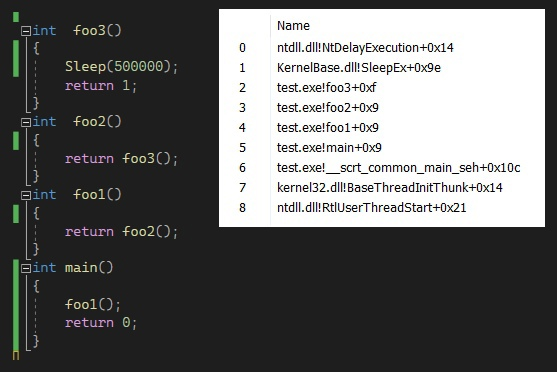
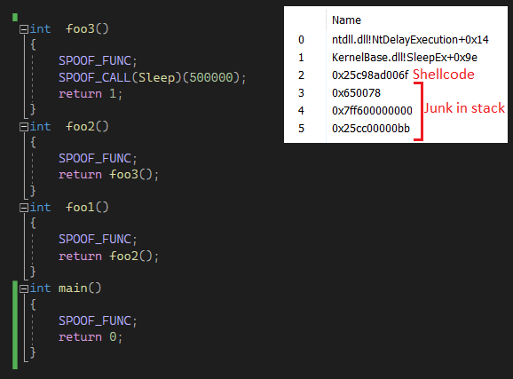

# CallStack-Spoofer

A simple tool that will make it harder to find your code by stackwalker or other stack analyze.<br/>
This works both in the kernel-mode and in the user-mode.<br/>
Safe with runtime exceptions.<br/>

[How in work, PoC](#PoC)

### example in user-mode
```cpp
SPOOF_FUNC;//spoof current function
SPOOF_CALL(Beep)(500, 500);//spoof system call
```

### example in kernel-mode
```cpp
SPOOF_FUNC;//spoof current function
SPOOF_CALL(ULONG,Beep)(500, 500);//spoof system call
```

### presetting
- For kernel- disable Control Flow Guard (CFG) (/guard:cf in msvc)<br/>
- Developed for the x64 platform.<br/>
- Requires changes for x32.<br/>

### c++ standart
- Usermode c++17 and above<br/>
- Kernelmode c++14 and above

### PoC
Call stack with spoofer disabled | Call stack with spoofer enabled
--- | ---
 | 

There are 2 modes of operation:
 1. Erase the return address of the current function and restore it when the destructor is called during the return of the function. Since we are using a class with a local scope, we will call the destructor anyway. This also works with exceptions.
 2. Generate a shellcode that will proxy our system calls, as a result of which the return address will not point to our code.

While the first case is simple, the second case is a bit more complicated. What should we know? The function template generates a function at compile time with certain parameters that we call it with in the code. Subsequent calls will use the already generated function. Therefore, we can get the address of the generated function like this:
```cpp
	PVOID self_addr = static_cast<PVOID>(&ShellCodeGenerator<RetType, Func*, Args&&...>);
```
With each subsequent same call, the address will match. Therefore, we can cache our matched shellcode and template function address pairs so that we only allocate the shellcode once and then use it. For backwards compatibility with the kernel, no standard containers are used.

It is important to understand that no function calls should be used in the shellcode, except for calls via direct addresses, because the calls use **nearcall**, and we will get an invalid relative call.
We also encrypt our return address with xor , because it will still be stored on the stack.

~~It was written in a hurry, so there are flaws here.~~
